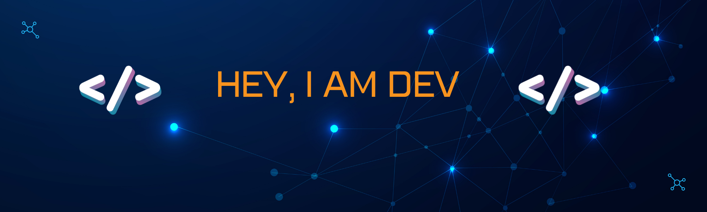

<h1 align="center"> Namaste  , I'm <em>Dev</em> 👋 ! </h1>

 

# 

 

- 🔭 I’m currently working on Java & Web  Development 
- 🌱 I’m currently learning Data Science
- 📫 How to reach me:   
 [)](https://www.linkedin.com/in/devkumaar/)  
- 😄 Pronouns: He/His 

  
 

## ⚡ Technologies I Know ⚡

                 

## 📉 **Github Stats**

 
<!--  -->

 
<!-- 

  
 
 -->
