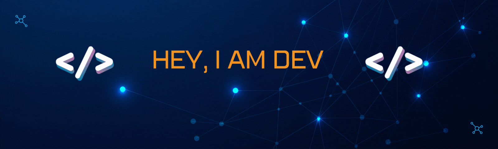

<h1 align="center">Hi 👋, I'm Dev Kumar</h1>
<h3 align="center">A passionate developer from India, interested in Software Development, Artificial Intelligence, Data Science, Web Development</h3>

  

- 🔭 I’m currently working on **Java, Data Science, Web Development**

- 🌱 I’m currently learning **Data Science and Machine Learning**

- 👨‍💻 All of my projects are available at [https://devvkumar.netlify.app/](https://devvkumar.netlify.app/)

- 📫 How to reach me **dkkardam49@gmail.com**

- ⚡ Fun fact **I DONT KNOW 🤷‍♂️**

<h3 align="left">Connect with me:</h3>

<h3 align="left">Languages and Tools:</h3>

                 

&nbsp;

